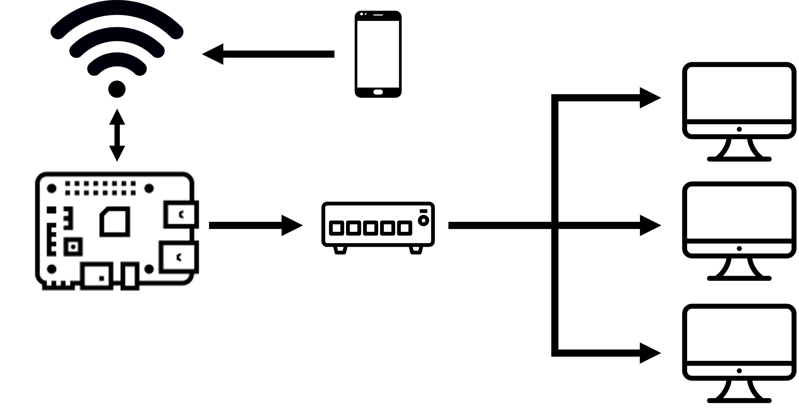

<p align="center">
  <h2 align="center"> Raspberry Wake-On-LAN</h2>
  
  <p align="center">
  Alessandro Rizzetto
  </p>
 </p>
 <br>
 
 ---
 
## Table of contents
- [The Project](#Project-Description)
- [How to Setup](#How-to-Setup)
  - [DNS](#Setup-a-Dynamic-DNS)
  - [Server](#Server-Configuration)

# Project Description
<p align="center">
  


The goal of this project is to turn on different devices connected to a Raspberry Pi.  
This is possible thanks to a dedicated android application, connected to a python server running on the Raspberry.  


# How to Setup
## Setup a Dynamic DNS
- Head to [duckDNS](duckdns.org) and create your sub domain after logging in or creating an account.
- Click on the install tab, chose your OS (Pi in this case) and select your domain from the drop down.
- Follow the proposed tutorial paying attention to create the duckdns directory in your home.

## Server Configuration
Clone the repository and update server.py with the IP address of your Raspberry and the desired port at line 19.

```bash
git clone https://github.com/elrich2610/raspberry_WOL.git
cd raspberry_WOL
nano server.py
sudo python3 server.py
```
It is possible to run the server as a service at start up by following above steps.
The service definition must be on the /lib/systemd/system folder. Our service is going to be called "wakeon.service":

```bash
cd /lib/systemd/system/
sudo nano wakeon.service
```
Copy the following text and save the file:

```bash
[Unit]
Description=Wake-On-LAN
After=multi-user.target

[Service]
Type=simple
ExecStart=/usr/bin/python /home/pi/raspberry_WOL/server.py
Restart=on-abort

[Install]
WantedBy=multi-user.target
```
Now that we have our service we need to activate it:

```bash
sudo chmod 644 /lib/systemd/system/wakeon.service
chmod +x /home/pi/raspberry_WOL/hello_world.py
chmod +x /home/pi/raspberry_WOL/wakeon.sh
sudo systemctl daemon-reload
sudo systemctl enable wakeon.service
sudo systemctl start wakeon.service
sudo systemctl status wakeon.service
```

## Application configuration
Download the app apk directly to your smartphone and install it by flagging it as an inoffensive file.  
After opening the app, enter the http address of your server (which you can find on the DuckDNS page).  
From the settings configure the MAC addresses of your devices and then everything is set up.  
Enjoy!


